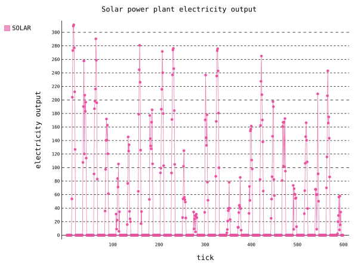

# Algotrade hackathon

Algotrade hackathon game rules and technical details.

In case of any questions, ping organizers in discord or in person!

## Table of contents
1. [Task description](#task)
    1. [Resource market](#resource_market)
    1. [Power plants](#resource_market)
    1. [Electricity market](#electricity_market)
1. [Ticks](#ticks)
1. [Rounds and scoring](#games)
1. [Appendix](#extra)
    1. [Order matching example](#order_matching)
    1. [Bot orders mechanics](#bot_orders)

## Task description 

There is a simulated stock exchange for resources and energy.
At the beggining of a game you are given a sum of money. 
You can buy and sell your resources on *resource market*.
Resources can be stored in your storage.

You can also process resources you own and produce electricity using *power plants*. This electricity can be sold on *electricity market*, but cannot be stored.

Player with the biggest networth at the end of the game wins!

## Resource market 

There are 5 types of resources in this game. These are **coal, uranium, biomass, gas and oil**. They all have different power outputs and different prices for respective power plants.
Users can buy and sell resources using *orders*.

Game is split into [ticks](#ticks). During ticks you place your orders which will be put in the order matching engine at the end of the tick.

Order is defined by:
- order side: BUY / SELL
- resource: resource you want to buy or sell
- order size: number of resources you are trading
- order price: price per unit of resource you are selling (not the total price of the order)
- expiration tick: tick in the game when this order expires (see api docs for details)

### Matching engine 

will place the orders by the time of arrival - as if they were evaluated real time. They are evalueated at the end of the tick for performance reasons. 

- If the order is BUY order: engine will look for the SELL order with the lowest price that is already in the engine and if the price is lower than the price of the BUY order, they will match. 
- If the order is SELL order: engine will look for the BUY order with the highest price that is already in the engine and if the price is lower than the price of the BUY order, they will match.

If during this process there are two orders with the same price, engine will look for the first one. If no matching order is found, placed order will be saved by engine for later matching, until it expires.

When orders match, price of the first order is set as trade price. Then the engine checks if the selling player has enough resources and if buying player has enough money. If not, the respective order is cancelled. Otherwise, both order sizes are reduced until one of them is filled. One that is not filled is matched again. See [example](#matching_example).

### Bot orders

Every 5 ticks, our bots create new resource orders (both buy and sell). Price is determined by dataset and [pricing mechanic](#bot_orders). Volume is set to keep players total resources constant. For example if players colectively have a lot of resources, our bots will have bigger buy volume, but smaller sell volume.

## Power plants 

There are two types of power plants: renewable and non renewable.

Every power plant you buy of one type makes the next one more expensive. You can also sell them at 70% of their original price.

Exact formula for price of power plant is:

$$
Base price \times (1 + 0.1 x + 0.03 x^2)
$$

Where x is the number of power plants of this type you already own.

### Non renewable

Non renewables require resources to run, but produce a lot of stable electricity. You can set how much resources of each type you want to burn. But you cannot burn more resources than power plants of that type that you have. 1 resource burned = 1 power plant is on.

### Renewable

Renewable always produce electricity following the dataset. However, renewables produce less electricity and less reliably. You can use modeling to predict how much they will produce, since every tick is one hour in dataset, which means that one day is 24 ticks.
For example, solar plants will produce more electricity during daytime.

You can see example of electricity production from one solar plant below.

## Energy market 

Energy market is simpler than resource market. You will set the price for your electricity. Our market will have certain volume of electricity each tick (electricity demand) and the maximum price at which it will buy electricity. It will look for cheapest electricity from players and buy as much as it can. If it is not filled, it will look for more. If two players have the same price, we will sell it proportionaly to the electricity they produced.

## Ticks 

In one tick players can create new orders and do other requests.

At the end of tick following things happen in this order:

1) Resource orders are added to match engine in time order, and 
then matched on the price-time priority

1) Power plants consume set ammount of resources and then
produces electricity

1) Energy agent buys players energy on price priority
    - If you have energy that is not sold to energy agent, it is destroyed!
So make sure you produce the right amount of energy

## Rounds and scoring 

There will be multiple games during hackathon.

- One game will be open all night long for testing your bots, this game will have annotation `is_contest=False`.

- There will be **three competition** rounds lasting for 30 minutes. These 
rounds will be scored and they have annotation `is_contest=True`.

- Around one hour before each competition round, we will start a **test round** that will simulate contest. They will also last 30 minutes, have the same limitations, but will not be scored. We encourage you to use your best bots here to promote good competition, however don't have to since these rounds aren't scored. These rounds will also have annotation `is_contest=True`.

You will be able to differentiate between competition and test rounds by names, or ask organizers.

Normal round `is_contest=False` lasts all night long and may be reset a few times. You may have 10 bots in one game and can reset their money balance. Ticks in these games are longer so you can see more easily what is happening.

When `is_contest=True` (including both test and competition rounds), ticks last one second, and your team is limited to one bot. You can not reset the balance of this bot! So make sure everything goes as planned and that you don't waste your resources and money.

All games will use different datasets.

### Team secrets and creating players 

Each team will get a unique `team_secret`. Make sure to send it as a query parameter in all requests you send! Do not share this secret with other teams.

Each game has unique `game_id`. In games you will be able to create multiple players for testing purposes (so that each team member can create their own bots for example). This is of course restricted in contest rounds.

Note: if you created player in one game, it is not created in all games!

See [api docs](/docs) for more details.

### Scoring

You are scored by your players net worth. This is calculated as sum of sell prices of every power plant you own plus money you have plus value of resources you own in current market prices.

## Appendix

### Order matching example 

The table below is showing already placed orders for coal resource.

| Order id| Side |Price | Size |
|-| -----|-----|-----|
|1| BUY | $250 | 400 |
|2| SELL | $260 | 300 |
|3| SELL | $290 | 300 |

Now three new orders arrive in this order:
[
(4, BUY, $270, 400),
(5, BUY, $280, 100),
(6, SELL, $220, 100)
]
During the tick, they are saved to queue. At the end of the tick, orders are matched:

First order in queue (order 4) is matched with order 2. Trade price is set to $260 and size to 300. Order 2 is filled, and player who placed order 4 will pay 300 x $260 = $18,000. However order 4 is still not filled. Now it matches again, but all orders are too high, so it is saved by the engine. Table now looks like:

| Order id| Side |Price | Size |
|-| -----|-----|-----|
|1| BUY | $250 | 400 |
|4| BUY | $270 | 100 |
|3| SELL | $290 | 300 |

Order 5 is now matched, but all SELL orders are too expensive. It is also saved by engine.

| Order id| Side |Price | Size |
|-| -----|-----|-----|
|1| BUY | $250 | 400 |
|4| BUY | $270 | 100 |
|5| BUY | $280 | 100 |
|3| SELL | $290 | 300 |

Order 6 is matched with order 5 with price $280 and size 100. Both orders 5 and 6 are filled. Player who placed order 5 pays $280 x 100 = $28,000, and player 6 pays 100 oil resources. In the end the table looks like this:

| Order id| Side |Price | Size |
|-| -----|-----|-----|
|1| BUY | $250 | 400 |
|4| BUY | $270 | 100 |
|3| SELL | $290 | 300 |

### Bot orders mechanics 

**Constants in this explanation may be changed**

This mechanism is done for each resource seperately.

Bot total volume is set between 100 and 400. If players have 10000 resources, then both sell and buy volume will be 200. If players have more total resources than 10000, buy volume will be reduced linearly, and sell will be increased linearly. Same is done otherwise.

Price is taken directly from dataset for the tick (about 1000-3000 per resource), but some bot coefficient is added. This coefficient is between -100 and 100. It is different for buy and for sell, so it is possible that buy and sell prices from bots are much apart.
Buy coefficient is bigger if last bot buy orders (those from previous 5 ticks) were sold well - if they were more filled. If previous buy orders weren't traded at all, it means that bot price is too high and that it should lower it.
It is done the same for sell orders but in different direction.
If final bot buy is higher than final bot sell, then the new price is calculated as weighted (by already calculated bot buy and sell volume) of these two prices. Then these prices are equal, and sell price is increased by 1 - so that bot doesn't sell resources to itself.

Once the price and volume is determined, bot *disperses* the orders. It creates many smaller orders totaling in volume to the calculated volume from before, but with small variations in pricing from the original (about 1%).